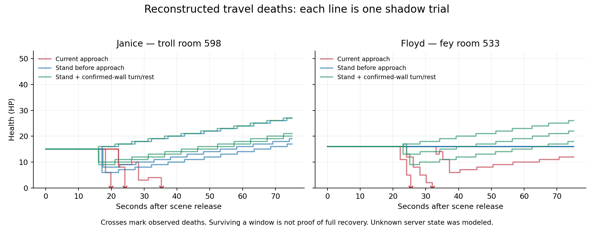

# Ten production monster deaths: travel and refuge recovery

**Follow-up correction:** the expanded investigation found that unsolicited
snapshots from scene setup could make position confirmation return before a new
reply arrived. The protocol-3 trials below remain preserved, but their arrival,
healing and comparative survival results are provisional. Use the corrected
protocol-5 comparisons in [the expanded travel review](travel-zero-review-2026-09-15.md)
for current recommendations. This does not erase the original deaths or the
independently demonstrated missing-stand precondition.

The cohort was selected at **21:49 PDT on September 14, 2026** (04:49 UTC September 15), then kept fixed rather than changing as new deaths arrived. Recommendations and experimental results below concern this cohort, not a fleet-wide mortality estimate. Production survival policy was not changed for these experiments.

The strongest candidate is a missing **stand before moving toward a recovery wall**. The keeper can finish its frozen rest and attempt movement while still sitting. A second problem is completing recovery after arrival: it must confirm that the character actually remains at a safe wall and turn to enable healing after login. An open freeze can buy time, but cannot safely heal the character. The comparisons below measure deaths and health recovery separately.

## Findings from all ten records

All ten deaths have a named monster in the personal death message and the death announcement. These are monster killing blows; that classification does not establish who caused every earlier point of damage. The retained combat text does not establish a Morpheus attack in this cohort.

All ten had panic logoff, safe-spot use, flee and rest enabled in their final telemetry. All ten ended inside `passFleeAndRest`, after 165–380 seconds in that stage. This is principally a failure to complete recovery, rather than evidence that the protections were simply switched off.

Nine records say `doing: travelling`. That label also covers walking to a nearby recovery wall. Only Janice and Floyd preserve an interrupted journey in the final replay window: destinations 39 and 376 respectively. Kermit's longer decision history includes an earlier travel shelter, but its fatal checkpoint is local recovery in Castle Victoria. The remaining records have no preserved journey at the fatal checkpoint; that is not proof that they had never travelled earlier.

Times below are **September 14, PDT**. Coordinates are named row/column.

| # | Time | Character | Monster | Room, position | Fatal recovery evidence |
|---|---|---|---|---|---|
| 1 | 21:44:14 | Rowlf | Battered skeleton | 39, r3c28 | Earlier reached r3c27; logoff failed to retain that wall. Later fine approach lasted 116 s; repeated watchdog replacements. |
| 2 | 21:40:34 | Robin | Troll | 597, r23c22 | No movement across 163 s of movement samples. Repeated open logoffs, then an interrupted two-step refuge approach. |
| 3 | 21:13:19 | Rowlf | Zombie | 39, r8c20 | Approximately stationary. One fine approach lasted 109 s; later recovery toward r10c19 ended in death. |
| 4 | 21:10:58 | Janice | Troll | 598, r34c16 | Confirmed interrupted journey. Local refuge failed; exit fallback toward room 599 required a 32-step path at 15 HP. |
| 5 | 21:10:46 | Kermit | Battered skeleton | 39, r7c29 | No movement across 264 s of samples. Fine approach lasted 146 s before replacement; repeated short cancelled approaches followed. |
| 6 | 21:02:14 | Clifford | Battered skeleton | 39, r8c16 | No movement across 297 s of samples. Fine approach lasted 152 s before `clear_path` interrupted the fallback. |
| 7 | 20:59:21 | Waldorf | Baby spider | 535, r16c26 | No movement across 225 s of samples. Exhausted open-logoff retries, then died approaching r14c23. |
| 8 | 20:52:09 | Robin | Zombie | 39, r9c30 | Recovery approach spent 72 s before cancellation, followed by repeated watchdog replacements. |
| 9 | 20:37:48 | Floyd | Fey dirhai | 533, r16c48 | Confirmed interrupted journey. Nearest refuge was one step away; an interrupted approach escalated to an 18-step exit at 13 HP. |
| 10 | 20:36:28 | Loial the Ogier | Battered skeleton | 39, r8c19 | Two roughly 93-second open freezes at 14/20 HP, then a four-step refuge approach remained unfinished until death. |

The route-shelter stop counter is zero in each final summary. That counter does **not** count every local recovery decision: several histories explicitly show refuge arrivals. It must not be used to infer that no shelter was attempted.

## A specific movement precondition is missing

The frozen branch of [`Autopilot.pass()`](../tools/m59-autopilot.mjs) sends `rest` and returns. When the freeze expires, the recovery branch can proceed into [`skills.returnToSpot()`](../tools/m59-skills.mjs) without standing. `returnToSpot()` calls the fine/coarse movers but does not perform the stand used by exit approaches.

The server's `Player.ResetPlayerFlagList` sets `PFLAG_NO_MOVE`, `PFLAG_NO_FIGHT` and `PFLAG_NO_MAGIC` while resting. `UserMove` refuses movement with `PFLAG_NO_MOVE` and sends the existing position back. Dodge also refuses with that flag. Consequently, a correct geometry plan can turn into repeated position corrections while the character remains exposed and cannot use its dodge skill. Ordinary attack misses can still produce “avoid” messages.

This is an execution-precondition problem. A timeout or different path cannot by itself clear it. Exit recovery eventually sends stand, but by then the bot may be trying a much longer route with very little health left.

Historical posture is not recorded directly, so this mechanism cannot be attributed conclusively to all ten deaths. The simulations test both the complete frozen-to-movement transition and controlled seated/standing starts.

## Shadow experiments

The main comparison uses checkpoints approximately 30 seconds before Janice's and Floyd's deaths. Both are still in their recorded frozen recovery phase. The real keeper sends rest, reaches the end of the freeze and attempts recovery; posture was not artificially forced in these travel comparisons. Each of the following variants runs three times per scene for 75 seconds, with a fresh native world restore and engine process:

| Variant | What changes |
|---|---|
| Current approach | Current keeper policy and movement, with the replay restoration described below. |
| Stand before approach | Send the existing ordered `standBeforeGo` command immediately before fine/coarse approach movement. Other survival decisions remain unchanged. |
| Stand + confirmed-wall turn/rest | Same movement fix. Once the keeper adopts a safe wall, confirm position again, choose a replacement `rest_safe` decision, turn in place, and continue recovery without another reconnect. Outside a confirmed wall, retain the original logoff behavior. |

All **18 corrected trials** completed with verified loads and no execution errors.

| Scene and starting HP | Current approach: deaths / trials | Stand before approach: deaths / trials; final HP | Stand + confirmed-wall turn/rest: deaths / trials; final HP |
|---|---|---|---|
| Janice, 15/49 | **3/3**; died at 19.8, 24.1, 35.3 s | **0/3**; 17, 27, 19 HP | **0/3**; 20, 21, 27 HP |
| Floyd, 16/45 | **2/3**; died at 32.0, 25.4 s; survivor ended at 12 HP | **0/3**; 16, 16, 16 HP | **0/3**; 22, 18, 26 HP |

Across these two reconstructed scenes, the observed 75-second death count fell from **5/6 to 0/6** with stand before movement. Janice healed in every modified run. Her nearby refuge approach completed in 0.61–0.64 s, compared with baseline fine attempts around 4.7 s that failed to establish recovery. Two baseline histories escalated toward the distant exit, matching the original failure sequence.

Floyd exposes the limitation of that result. All three stand-only approaches initially reported arrival at r15c47 in 0.83 s, but subsequent recovery observed r16c47, failed the safe-wall check, and retained a nonacting freeze. **All three survived without gaining any HP.** That is time bought, not successful healing.

The complete confirmed-wall turn/rest variant also had **0/6 deaths**, and every trial ended above its starting HP. Native reads confirmed the turn at Janice's r34c16 or Floyd's r15c47, with the action flag set and a normal health timer present. The subsequent one-second samples showed no HP decreases after that confirmed turn in any of the six trials. Some damage occurred before this boundary: Floyd reached it with 14, 10 and 18 HP. This supports the transition under these tested conditions; it does not establish that every apparent safe wall is safe.



Each line is one trial; Floyd's three flat stand-only traces overlap at 16 HP. Crosses mark observed deaths. No modified run reached full health or demonstrated a completed onward journey within the 75-second observation window. These results show improved short-term survival and, for complete recovery transitions, actual healing. They are not a measured long-term fleet survival rate.

The third variant is a combined intervention: retaining a confirmed wall, avoiding another reconnect there, explicitly turning, and continuing rest. Its result cannot identify which individual component accounts for the difference. The approach itself already sets the action flag; the explicit turn supplies a clear recovery transition. Native reads verify the wall position, action flag and active health timer, and health samples check whether that recovery actually pays.

### Simulator correction and retained preliminary evidence

The first experiments exposed a loader defect. Assigning wounded HP to a character restored from a full-health native save did not necessarily create the server's health timer. Even an explicit successful turn could then produce no healing. This particularly disadvantaged variants that avoided reconnecting or taking another hit, either of which could start that timer.

The shared scene loader now calls the server's normal `NewHealth` and `NewMana` handlers just before release and verifies that required timers exist. It grants no HP, does not force the action flag, preserves an existing timer, and records a release receipt. Historical timer phase remains unknown. The main table uses only the corrected protocol (version 3); all earlier runs, setup failures and logs are retained separately, not pooled into its counts.

Those earlier runs still contain useful observations. Waldorf's controlled seated starts reproduced immobility: one died in 42.3 seconds and one remained at 4 HP after 45 seconds; standing before movement reached the refuge in about 1.6 seconds. His naturally standing control also reached it. A giant rat delivered the replay killing blow rather than the original baby spider; that does not erase the reproduced inability to move. Historical posture is still unrecorded, and the earlier healing comparisons are provisional because of the timer defect.

A preliminary Floyd variant that suppressed safe-wall reconnect without supplying the complete recovery transition also saw a position correction away from the first refuge. **Reconnect alone is therefore not established as the cause of displacement.** Its no-healing outcome is provisional; the position observation is useful. A successful approach must survive a later authoritative read before a turn is considered safe.

## Recommendations and trade-offs

1. **Stand immediately before a committed refuge approach that requires movement**, using the same ordered packet path as exit travel. Check cancellation/ownership before and after the await; keep the existing early return for a bot already at its refuge. This preserves the chosen strategy and destination. Its cost is approximately one paced packet before moving. It deliberately ends sitting only when the survival decision already requires movement; it must not be added to a passive freeze or a stationary safe-wall recovery.
2. **Make wall arrival, turning and observed healing distinct recovery checkpoints.** If a fresh position read confirms the retained wall, execute the chosen recovery action and confirm that health starts rising. If it does not confirm the wall, preserve the nonacting freeze until an explicit movement decision replaces it. Never turn in the open to test whether healing works. The combined wall-turn/rest experiment measures a conditional alternative to another safe-wall reconnect; it does not justify removing logoff globally. Its trade-off is retaining current monster engagement rather than clearing it through reconnect, so a false safe-wall classification would be costly.
3. **Give refuge approaches a progress and elapsed-time budget**, not just a step count. The caller often supplies 24 steps, but the fine approach independently defaults to 60, and its fine-path waypoint loop is separate. Recorded 109–152 s attempts for nearby refuges are too long to treat as healthy progress. Check authoritative movement and health, then explicitly replace a failed decision with a new candidate. An aggressive budget can abandon a difficult but reachable wall. This recommendation is a follow-up hypothesis, not a measured benefit in this experiment.
4. **Preserve recovery before committing to a long exit.** Janice and Floyd escalated from nearby refuges to 32- and 18-step exit paths at 15 and 13 HP. Prefer reachable, unoccupied nearby recovery once movement works; then resume the route. Exit fallback remains useful when no nearby refuge is reachable. No change to exit selection was independently tested here.
5. **Improve the replay evidence for this boundary.** Capture the last rest/stand command and its age as client intent, separately from authoritative posture where available; capture freeze retry counters and watchdog state; retain the first checkpoint of each survival episode as well as the final rolling window. Distinguish route travel from a recovery approach in the postmortem label. These fields would let future reports distinguish a seated bot, body blockage, geometry failure and an interrupted approach without reconstructing missing state.

Do not raise flee thresholds, remove refuge protections, or globally suppress watchdog cancellation on the strength of this cohort. Those change when or whether recovery is attempted; the strongest candidate here concerns executing a decision that was already made. Freeze invalidation was not modified.

## Reproduction and limits

The source records and checksummed replay bundles live under production `substrate/postmortems` and `substrate/replays`. The private frozen cohort, scene cases, loadout models, receipts and analysis live under `substrate/replay-smoke/travel-review-2026-09-15/` in the investigation worktree. Runtime evidence and account material are not committed.

The retained experiment runner is `substrate/replay-smoke/travel-review-trial.mjs`; exact worker source is also archived by SHA-256 under the evidence directory's `experiment-sources/`. Its batch invocation is:

```text
node substrate/replay-smoke/travel-review-batch.mjs 4,9 baseline,stand,wall-turn-stand natural 3 75000
```

It requires the private owned-lab configuration, frozen cases and native checkpoint; a source checkout alone is not the saved experiment. `corrected-results.json` records the main trial file hashes and compact results. The frozen cohort's SHA-256 is `3c179e73202e1cb6f80f965a776757407c9704cbeec7511adc7b81157954122f`.

The experiments use the owned `m59-replay-lab` container on game port 17959 and maintenance port 17998, with native room hold/release and a native world reset before each trial. They do not use the other shadow server or production accounts. Real protocol movement and monster attacks run after release; damage is not injected.

Each scenario restores recorded fine positions, HP/current ceiling, mana, vigor, attributes and the captured controller policy. Victim item classes, quantities, equipped identities and ability percentages are reconstructed; unrecorded item condition/enchantments, ability advancement flags and monster HP/targets/timer phases remain assumptions. Other visible players, where used, are idle account-backed stand-ins. The unknown magical ring in Loial's inventory cannot be faithfully identified. Lab scenery is explicitly selected; room-entry items are included and reported, while unexpected players or monsters still fail verification.

The replay uses a fresh engine process per trial and the actual server image/source attestation. It restores the captured `doing` state and starts the watchdog before resuming an approach. Late-checkpoint freeze retry exhaustion is reconstructed from the postmortem, because those counters were not saved. The safe-spot book is a fixed copy of the production book taken during this investigation, not an unavailable historical version. Server RNG, original timer phases, human inputs and the suspended JavaScript stack are not restored.

Production captures identify harness commits `47a2cb6`, `d4d819c` and `d4e430a`. The experiment uses `d4e430a` plus the documented lab scene-loader corrections and local instrumentation. Each corrected trial records its source manifest hash, exact experiment script hash, native server image/source/patch attestation, release receipt and assumptions. `experiment-provenance.json` belongs to the earlier protocol and is retained as such; it is not the corrected trial attestation. Different death times or a different attacking monster remain useful evidence when an immobile-recovery failure recurs. Setup failures and observation-window survivors remain separate from deaths and full recoveries.

All ten deaths were reviewed. The repeated strategy comparison deliberately concentrates on the two cases with preserved journeys; it is not ten independent character scenarios, a historical bit-for-bit replay, or an estimate of how many of the ten production deaths the change would have prevented. The trials are repeated stochastic observations, not matched RNG-seed pairs.

The lab loader checks passed: 9 vital-timer scenarios, 98 scene assertions, 31 death-replay scenarios and 13 scene-simulator tests. Production strategies and freeze invalidation were not modified.
