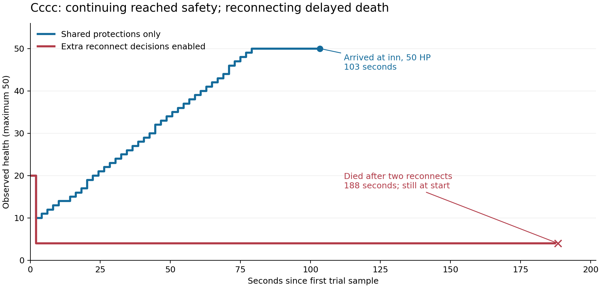

# Shadow fleet: do the extra travel decisions save lives?

September 14, 2026. Runtime under test: production commit `e1c26da`, including the shared
track-shelter repair. This report evaluates the differences identified in the
[shopping decision analysis](shopping-travel-decisions-2026-09-13.md).

<!-- FINAL FINDINGS -->
**No lives saved were demonstrated in the completed tests.** Across 20 live trials,
the shared-protections control had **7 deaths and 3 arrivals**, while enabling the
extra reconnect decisions produced **10 deaths and no arrivals**. All three control
arrivals reached the inn at full health. Six protected runs successfully interrupted
the initial danger but eventually died after **188–199 seconds**. Their early survival
would have been misleading if observation had stopped at 90 or 180 seconds.

This supports **not adding these reconnect decisions to internal shopping merely
because they are called survival protections**. It does not establish that reconnects
never help, or justify removing shared shelter and recovery. The separate contribution
of the rapid-damage branch remains unmeasured: its isolation runs were blocked before
starting. No production policy or freeze code was changed.

| Completed series | Runs per setting | Shared protections: deaths / arrivals | Extra decisions: deaths / arrivals |
|---|---:|---:|---:|
| Severe: 20/50 HP, four trolls, two routes | 8 | 7 / 1 | 8 / 0 |
| Milder: 35/50 HP, two trolls, Flatlands | 2 | 0 / 2 | 2 / 0 |
| Descriptive total | 10 | **7 / 3** | **10 / 0** |

There were ten paired comparisons involving eight characters. Three pairs arrived
under control and died with the extra decisions; none did the reverse. Seven died
under both settings. No completed run was censored at 300 seconds. These small,
selected samples are not a production effect-size estimate.
<!-- END FINAL FINDINGS -->

## What the experiment actually compares

Both arms used the real local shadow fleet, real server attacks, real movement, and
unchanged production keeper code. The control disabled `travelGuard.flee` and
`travelGuard.fight_back`; the treatment enabled them. Shared route shelter, track
shelter, hop recovery, the independent watchdog, and ordinary recovery after a travel
interruption remained available. `arm` was off in both arms.

This isolates the two additional decisions that an internally awaited shopping leg
misses. It does **not** replace shopping's scheduler: both arms used an externally
requested journey with `run_errands:false`. The control's pass loop was available but
those two branches were disabled. Actual bank transactions, purchases, the return leg,
and subsequent farming were not measured. Reaching the inn is the measured service
opportunity, not a completed purchase.

The primary series contains eight matched character pairs: four on the Flatlands
(room 584) → Brownestone Inn (106), four on Cragged Mountains (598) → Familiars (52).
Each run started at 20/50 HP, 160 vigor, with only a mace equipped, 400 shillings,
and four adjacent trolls. The native server chose attacks and damage. Characters
were followed until their first death, arrival, or 300 seconds. The first and third
actors on each route received control first; the other two received treatment first.

The exploratory extension completed two Flatlands pairs at 35/50 HP with two trolls.
Two additional Crag pairs and two full-health Flatlands pairs isolating `fight_back`
were prepared but **not executed**: automatic approval review repeatedly failed because
its review model was at capacity. Their scripts are preserved as planned follow-ups,
not presented as evidence. In a rate-isolation run, `flee` would be disabled in both
arms to avoid having the earlier branch preempt the rate decision. Such a run would
still not measure the rate branch's marginal benefit when low-health reconnects act.

The effective low-health trigger at maximum health 50 was **68%**, despite the configured
`fleeBelow:0.5`: `safetyFor()` keeps a two-hit margin. This matters to the interpretation
of the 35-HP starts. `fight_back` attempts a reconnect when estimated remaining life is
at most ten seconds; it does not fight the attacker. The optional `arm` branch is off
by default and therefore contributes no difference under the normal configuration.
Enabling it was not evaluated.

Every recorded travel take-back in the completed series came from the low-health
branch. Thus the outcome evidence directly implicates that path and its recovery
handoff; it does not separately establish whether the rapid-damage branch saves lives.

## Primary outcomes and the cost of stopping

The primary series finished with **7/8 deaths and one arrival in the control**, versus
**8/8 deaths and no arrivals with the extra reconnect decisions**. No run reached the
300-second limit. Seven pairs ended in death under both settings; the remaining pair
arrived with control and died with the extra decisions. There was no reverse pair.
This is an observed difference of one death in eight pairs, not a precise estimate of
the treatment effect in production.

| Character | Route | Shared protections only | Extra reconnect decisions |
|---|---|---|---|
| Aaaa | Flatlands | Died, 2 s | Died, 2 s |
| Bbbb | Flatlands | Died, 2 s | Died, 189 s |
| Cccc | Flatlands | Arrived, 103 s | Died, 188 s |
| Dddd | Flatlands | Died, 2 s | Died, 2 s |
| Iiii | Crag | Died, 4 s | Died, 191 s |
| Jjjj | Crag | Died, 2 s | Died, 2 s |
| Kkkk | Crag | Died, 5 s | Died, 2 s |
| Llll | Crag | Died, 187 s | Died, 191 s |

Four protected runs recorded a low-health travel take-back. All four reconnected
twice, regained no health during the frozen intervals, and died after 188–191 seconds.
The other four protected runs died in roughly two seconds without a recorded travel
take-back. No protected run completed recovery or reached the destination.

Llll's control is also important: it reached a refuge and repeatedly healed, but died
when trying to make onward progress. Shared shelter is not a guarantee of a successful
crossing either. The useful distinction is acquired shelter and actual healing versus
a reconnect followed by neither, not the presence of a comforting journal message.

With the shared protections alone, Cccc fell to an observed 10 HP, kept moving, used
wall recovery, and reached Brownestone Inn at 50 HP in 103 seconds. With the extra
decisions, Cccc reconnected at 4 HP, remained on the starting square through two
frozen intervals, regained no health, and died at 188 seconds. Starting attributes,
equipped weapon, carried load, health, vigor, money, and square matched in this pair.

These are separate live encounters, not a replay of the same random attack sequence.
The pair is an observed counterexample to assuming that an interruption necessarily
improves the outcome; it does not prove that every cancelled crossing would have survived.
The causal mechanism visible in the journal is narrower and firmer: movement was
cancelled, no refuge was acquired, no healing occurred, and the eventual death happened
at the starting square. The control demonstrates that shared recovery could work on
this route without the extra take-back.

## The milder crossings did not rescue the benefit claim

| Character | Shared protections only | Extra reconnect decisions |
|---|---|---|
| Aaaa | Arrived in 78 s, 50 HP; observed minimum 21 HP | Died in 196 s; first reconnect at 29 HP |
| Bbbb | Arrived in 106 s, 50 HP; observed minimum 8 HP | Died in 199 s; first reconnect at 24 HP |

Both protected runs reconnected twice. During the frozen intervals, neither gained
health or progressed along the route. Both controls continued to shared wall recovery
and completed the crossing. These results extend the concern beyond the four-troll,
20-HP burst: the extra take-back also failed in a less severe encounter where both
controls could reach safety. They are an adaptive follow-up on two reused characters,
not an independent population sample.

What was sacrificed here was the opportunity to move out of reach, acquire a refuge,
heal, and get to the inn. Retaining the destination in a suspended-journey record did
not compensate for failing to acquire recovery. There were no completed purchases to
compare: the experiment stopped at death or inn arrival. Claiming an economic benefit
from a longer time alive would therefore be unsupported.

## How the evidence was collected

The shadow broker used loopback game port 15959 and control ports 8971/8972. The real
production broker and fleet were not part of the trials. The shadow runtime was started
from a separate worktree at `e1c26da`; no keeper or movement source was patched for the
experiment. The local native server identifies itself as BlakSton v2.4, built August 25,
2026. Its printed clock is seven hours behind the host timestamps; the evidence uses
host timestamps throughout.

Each trial used a fresh keeper process. Health and maximum health were reset between
trials, never during observation. Gear and starting location were verified before
release. Normal regeneration can add a point during staging, so health was reset and
verified directly on the server immediately before release. The Crag placement
consistently snapped from requested r35c25 to walkable r34c25. No other player was in
the starting room snapshots of the primary trials.

Observation read cached keeper state about once a second. It did not send inventory,
movement, or other packets that could wake a frozen character. Short disconnections
can temporarily leave HP unknown; death was established by the Underworld/zero-health/
maximum-health-loss endpoint and cross-checked against death journals. A survivor at
300 seconds without arrival is censored, not counted as a successful rescue. Reading
only the first 90 or 180 seconds would have misclassified several delayed deaths.

Setup attempts rejected for stale state or equipment were not trials. Five earlier
calibration runs selected workable routes and encounter pressure; they are excluded
from the matched totals. One completed primary run needed cleanup reconciliation
because a created monster had already been deleted by the game. Its recorded death
remains included. Created monsters were identified before cleanup; a missing identity
stopped deletion rather than guessing an object ID after server garbage collection.

## What these results can and cannot establish

These are small, deliberately selected pressure tests. They are not a sample of
production shopping frequency or an estimate of production death rates. The server's
attack randomness was not replayed, starting damage phase was not locked, and ambient
monsters and shared learned shelter data could change across runs. Order was
counterbalanced, not randomized. Character attributes were paired, but inventory
could change after a death; remaining inventory, skills and equipment condition were
not cloned. The evidence includes starting snapshots so those differences are visible.

Wounding during setup can populate the keeper's recent-damage history. That affects
both arms and is another reason not to attribute the combined low-health series to
the rate branch. The planned, unexecuted rate series starts at full health. None of
these trials tests low-vigor recovery, a hostile player, reconnect rejection, or a
long shopping cycle. They cannot establish that reconnects never help anywhere.

The independent watchdog and shared shelter were not removed. A control success is
evidence for continuing **with those mechanisms present**, not for removing survival
logic in general. The freeze implementation was exercised as deployed and was not
changed; this report does not reopen the excluded freeze-invalidation work.

<!-- RESTORATION -->
All 20 trial cleanup receipts are present. The experimental broker was stopped
orderly; the local server then reported only its two pre-existing non-fleet sessions.
All 21 original health/max-health values and equipped weapon classes were restored
and verified directly on the server. Original rooms/squares were restored and missing
inventory quantities topped up. The roster, credentials and saved policies compare
unchanged with the private backup. This was not a whole-world rollback: extra items,
item condition, ability percentages and historical death records are not restored.

**The shadow broker remains stopped pending a permitted restart.** Automatic approval
review rejected starting its original checkout, `lease-guard-identity`, because its
review model was at capacity. No alternative restart was attempted to bypass that
rejection. Production remained on `e1c26da`, broker PID 42752, with 23 keepers in game;
the four relevant source files matched the shadow runtime byte for byte.

The report and evidence are saved locally in the dedicated
`codex/shadow-survival-comparison` worktree. Committing them was also rejected by the
same unavailable approval-review service, so they have not been committed or pushed.
<!-- END RESTORATION -->

## Reproduction and evidence

The [protocol](reproductions/shadow-survival/protocol.md) records the primary design and
the separately declared exploratory extensions. The
[reproduction directory](reproductions/shadow-survival/README.md) contains the driver,
analysis, plotting code, and a credential-free compressed bundle of individual trial
metadata, observations, outcomes, and cleanup receipts. Private roster backups are
excluded from version control.
