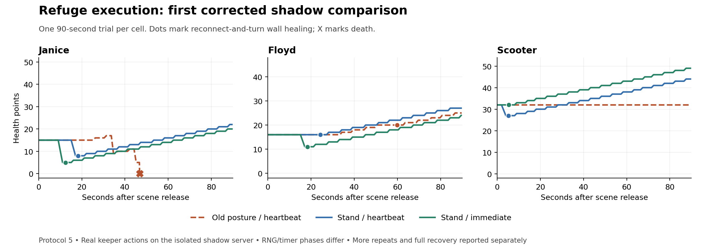

# Travel toward zero deaths: expanded review and survival execution

The target is zero travel deaths, including journeys interrupted for recovery.
Reaching a refuge, remaining alive for a test window, healing to readiness, and
completing the journey are separate outcomes. A bot parked indefinitely at low
health has not completed recovery.

## Expanded production evidence

The catalog frozen on September 15, 2026 scans 3,594 readable top-level
postmortems and groups duplicate reports for the same character within 30 seconds,
leaving 3,520 records. Of these, 2,725 have an observed monster killing blow.
This does not establish that every earlier hit was PvE. Archived subdirectories
are outside this catalog.

Forty-two monster deaths explicitly carry movement epoch `7bd2e1d0e9a9`.
They are not 42 travel deaths: many occurred during local recovery in Castle
Victoria or the Valley of Ileria. Three records preserve a journey somewhere in
their available replay: the previously reviewed Janice and Floyd cases, and
Scooter in Ukgoth on September 14 at 23:35:22 UTC. Scooter's selected later
checkpoint is already after the external controller cleared that journey.

Two older cases are useful tactical evidence despite incomplete captures:

| Death, UTC | Evidence worth retaining | Limit |
|---|---|---|
| Janice, September 14 20:38:38, Ukgoth, epoch `470868c18403` | Previously healed to 49/49 at r19c35. Later, a two-step refuge approach was cancelled by the errand runner; another was cancelled by the watchdog at 9 HP; the next began at 2 HP. | No detailed scene bundle. It motivates preserving recovery intent and immediate replacement; it cannot establish a current movement regression or an exact counterfactual. |
| Floyd, September 13 17:32:46, Flatlands, epoch unknown | Started the recorded window at 25 HP near r35c33, with eight monsters and several fleetmates. Recovery selected a route wall, was cancelled, then escalated through inconsistent refuge/exit targets and died. | No fine scene replay. Some selection faults have since been fixed. Useful for crowd/blocked-route scenarios, not a measured current failure rate. |

Scooter's newer record is especially revealing. He lost 32→24 HP after an open
freeze, selected a wall only two coarse steps away at r22c44, and was still
approaching when the watchdog cancelled at 5 HP. Death followed about 0.2 seconds
later. A late checkpoint approximately nine seconds before death allows a second,
explicitly exposed/seated reconstruction; the native action flags were not saved.

## Confirmed execution gaps and changes

1. **Standing was missing before refuge movement.** Frozen recovery sends REST.
   Freeze expiry does not clear the server's no-movement posture, which also
   disables dodge. The shared `returnToSpot` helper now sends the existing ordered
   stand before any required approach. It does not stand when already at the
   exact refuge. A queued cancellation prevents the obsolete stand and movement.

2. **Replacement survival decisions waited for heartbeats.** A lost wall or
   interrupted approach could select the next decision and return. A refused
   logoff additionally delayed a different refuge action by five seconds. The
   dispatcher now executes successive distinct alternatives within the same pass,
   including decisions selected by later stages. It retains ownership checks,
   packet pacing, the cancelled old travel stack, and a guard against repeatedly
   trying the same failed state without new information.

3. **Scene loading exposed stale position confirmations.** Unsolicited snapshots
   put the receive count two ahead of the request count. The next read therefore
   appeared complete before its reply arrived. In instrumented Scooter and Floyd
   runs, a real move toward the wall was followed by a move calculated from the
   stale starting position; the keeper then claimed an arrival the server no
   longer held. New requests now advance beyond both counters. This is a confirmed
   replay defect and a shared-client robustness fix. A follow-up runtime snapshot
   at 06:53 UTC also found two production keepers with three received snapshots
   against two requests.
   That confirms the counter imbalance can occur in production; it does not
   establish its frequency or attribute any historical death to it. The wire has
   no request IDs: advancing the ordinal fixes the observed already-received
   surplus, not every possible race with a later unsolicited packet.

The first two changes do not replace the safe-wall logoff strategy. Once actually
at a safe wall, the keeper still logs off, reconnects, turns there, and rests.
Turning in the open is not a safe healing tactic. Freeze invalidation was not
changed.

Future scene and postmortem telemetry includes the last sent rest/stand command,
freeze retry counters, and room-snapshot counters. A sent posture command is not
labelled as server-confirmed posture. The replay adapter restores captured
activity/counters and starts its watchdog before a resumed approach.

## Corrected shadow comparison

All trials use the owned `m59-replay-lab` server on ports 17959/17998, fresh native
world restoration, real keeper logic and protocol actions. Production was not used
for these experiments. Protocol 5 includes both normal vital timers and corrected
room-snapshot confirmation. Source hashes and exact experiment scripts accompany
each private receipt.

The three variants separate the effects:

- **Old posture / heartbeat:** suppress only the new refuge-entry stand and use
  the previous one-decision dispatcher and five-second retry pause.
- **Stand / heartbeat:** enable shared stand, retain those decision delays.
- **Stand / immediate:** shared stand plus immediate replacement execution.

These are controlled hooks on the current source, not executions of the exact
historical commits. Historical monster timer phases, RNG, bystander inputs,
unrecorded item condition/enchantments and native action flags are not restored.
Observed equipment identities and skill percentages are restored; the late
freeze-retry count is an explicit assumption for these old captures.

<!-- RESULTS -->
All 24 completed comparisons below passed load/release verification without
execution or cleanup errors. The first nine ran for 90 seconds unless death
ended the trial early; the shorter repeats and longer runs are identified separately.

| Scene, initial HP | Old posture / heartbeat | Stand / heartbeat | Stand / immediate |
|---|---|---|---|
| Janice, 15/49 | Died at 46.8 s | Alive, 22 HP; wall recovery at 18.3 s | Alive, 20 HP; wall recovery at 12.4 s |
| Floyd, 16/45 | Alive, 25 HP; different-room refuge at 59.8 s | Alive, 28 HP; local wall recovery at 24.3 s | Alive, 24 HP; local wall recovery at 18.4 s |
| Scooter, 32/51 | Alive, unchanged 32 HP; no wall recovery | Alive, 44 HP; wall recovery at 5.3 s | Alive, 49 HP; wall recovery at 5.3 s |

Wall recovery means the recorded reconnect-and-turn healing phase, not merely a
reported movement arrival. No HP decrease was sampled after that phase began in
the seven trials that reached it. Scooter's old-posture control did not reach a
wall. None had completed full recovery by 90 s.

Two additional Janice old-posture controls died at 40.9 and 17.0 seconds. Thus the
corrected Janice failure recurred in 3/3 baseline trials. Two additional
stand/immediate repeats survived 60 seconds, ending at 24 and 16 HP while healing
at the wall. At the common 60-second endpoint, the old behavior had 3/3 deaths
and stand/immediate had 0/3. Stand/heartbeat also survived its single 90-second
comparison. This is evidence of an improvement in this reconstructed scenario;
it does not establish a fleet-wide survival rate or an additional life saved by
immediate dispatch alone. The longer recovery trials below are reported separately.

Immediate dispatch removed about six seconds before wall recovery in Janice and
Floyd, compared with standing alone. Their nearest-refuge activation delays fell
from 5.19/5.25 seconds to 0.12/0.23 seconds. Scooter's natural checkpoint already
fell through directly to recovery, so its timing did not benefit from that change.
Different final HP totals are not a reliable ranking of the dispatch variants:
monster timers and RNG differ, and earlier movement changes exposure.

The later Scooter checkpoint was also tested in nine 45-second runs, three per
variant, with an explicit pre-start turn-and-rest action while monsters were held.
All nine survived. The old-posture controls ended at 33/51 HP without reaching a
recorded wall recovery; both modified variants reached the nearby wall in about
four seconds and ended at 32/51. This reconstruction does not reproduce the
original late attack pressure, so it cannot establish a life saved or establish
that open healing is safe in production. The capture lacks native action flags,
monster target memory and timer phases. Preserve it as a useful nonfatal
counterfactual and movement test.

Seven initial late-checkpoint setups were rejected before release because the
experimental turn changed the required facing. Those records remain archived;
restoring the original facing before release fixed setup verification, and those
cells were rerun. Setup rejections are not deaths or survivors.

Fresh-process restore-to-start times were 4.93–5.19 seconds for the initial nine trials.
That includes login, live equipment/ability synchronization, scene setup and
release; the native world restore itself was approximately 0.4 seconds.

Two longer stand/immediate trials test what happens after the initial window:

| Scene | Full recovery | Subsequent behavior | End of observation |
|---|---|---|---|
| Scooter, 240 s | First sampled at 51/51 HP at 136.8 s; recovery decision completed at 139.0 s | Left cover, took a 7-HP hit, continued moving and returned to full health | Alive at 51/51. This checkpoint had no saved journey; movement afterward does not prove completion of the original trip. |
| Janice, 450 s | First sampled at 49/49 HP at 185.2 s; recovery decision completed at 187.9 s | Attempted onward movement. Four exit approaches reported `collision_geometry_changed`. A later walk was cancelled as wedged; health fell to 26. Two open freezes held 26 HP for roughly three minutes, then a nearby wall enabled healing again. | Alive at 37/49, recovering. The original trip was not completed. |

The later damage occurred after leaving the first recovery wall. Neither longer
run had a sampled HP loss between the first reconnect-and-turn phase and that
recovery decision's completion. The adapter's single `recovered` outcome means
that a recovery completed somewhere in the trial; it must not be read as a
successful journey, current full health, or the absence of subsequent trouble.
Janice's onward geometry/wedge sequence is a retained follow-up scenario. Test
waiting under cover for a viable exit approach, and alternative short refuge
hops, against this sequence before selecting a further policy change. The two
open freezes were existing policy, not heartbeat delays; freeze invalidation
remains unchanged.
<!-- END RESULTS -->

Earlier protocol-3 and protocol-4 results remain on disk, including divergent and
nonfatal runs. They must not be pooled with protocol 5 to estimate effectiveness.
In particular, Scooter's earlier “wall turn/rest” variant died without actually
turning: its extra position read rejected the wall, an open logoff was refused,
and recovery retried. That is useful evidence about decision sequencing, not
evidence that turning at a confirmed safe wall killed him.

## What would justify saying travel is fixed

The immediate regression tests establish execution order and ownership. Shadow
trials must additionally show reproducible baseline deaths, improvement with the
change, actual healing at retained cover, and onward journey completion. Then
production needs an exposure denominator: completed trips, recovery interruptions,
time/distance travelled, and deaths under the same movement epoch. A handful of
survivors cannot establish a zero death rate.

Prioritize short, reachable refuge recovery before changing broad thresholds or
removing protections. Treat old crowd/wedge deaths as explicit scenario seeds
when a faithful scene is unavailable. Keep both beneficial and harmful variants,
and distinguish a nonfatal stall from a successful trip.

## Evidence and validation

Private evidence is under
`substrate/replay-smoke/travel-zero-2026-09-15/` in the death-replay worktree:
`catalog.json`, `interesting-cases.jsonl`, checkpoint cases, complete trial
receipts, `protocol5-results.json`, harness hash manifests, and exact experiment
script archives. Later runs also archive modified engine sources; the earliest
dirty-source runs have hashes but not a complete source-byte archive. The previous
ten-death cohort remains frozen separately under `travel-review-2026-09-15/`.
Runtime recordings and credentials are not committed.

Offline verification covers refuge posture, fresh position confirmation,
survival decisions/handoffs, recovery selection, travel shelter, collision,
policy gates, scene capture and replay. The new tests explicitly exercise a
blocked first refuge reaching its replacement in one dispatch, failed logoff
starting refuge movement before pass return, lost cover, explicit external
ownership, and bounded repeated failures.

The implementation is on main and deployed as
`2dd3c1068684c42c27d6b117be4066f57de0cd2e`, tag `deploy-2026-09-15-11`.
At 06:53:46 UTC on September 15, all 23 production keepers were verified in game
with new PIDs, that exact commit, and the new posture/snapshot telemetry.
The rollout preserved production's existing runtime files. Fourteen relevant
offline suites passed. This is a verified rollout, not a claim that the fleet has
achieved zero travel deaths.
